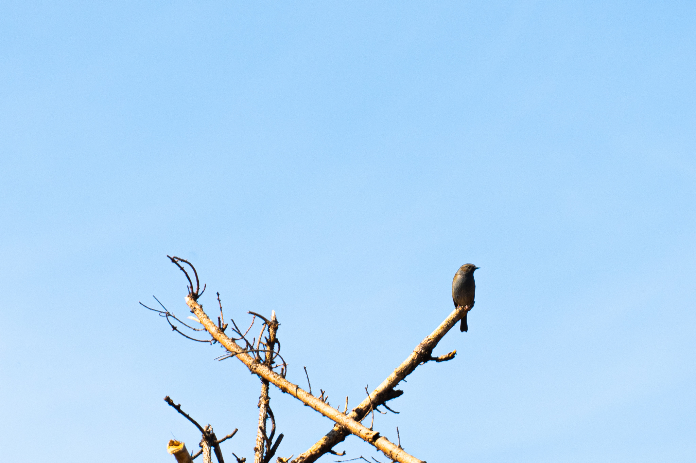
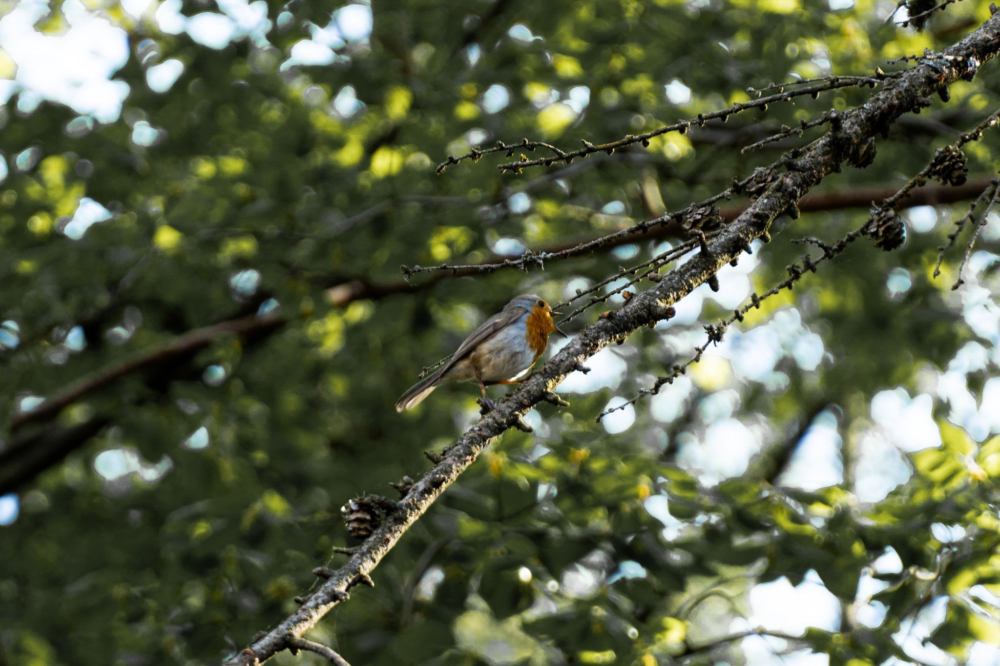
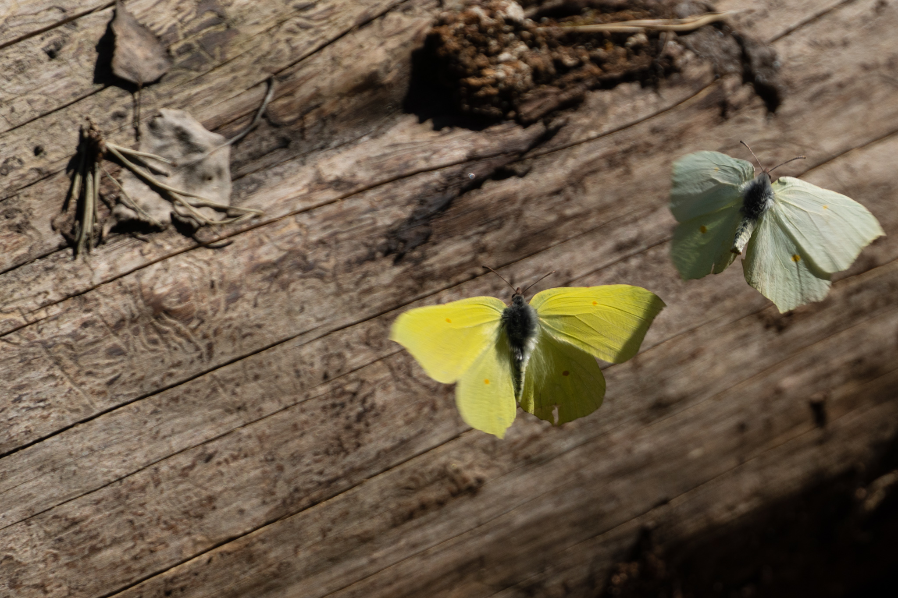
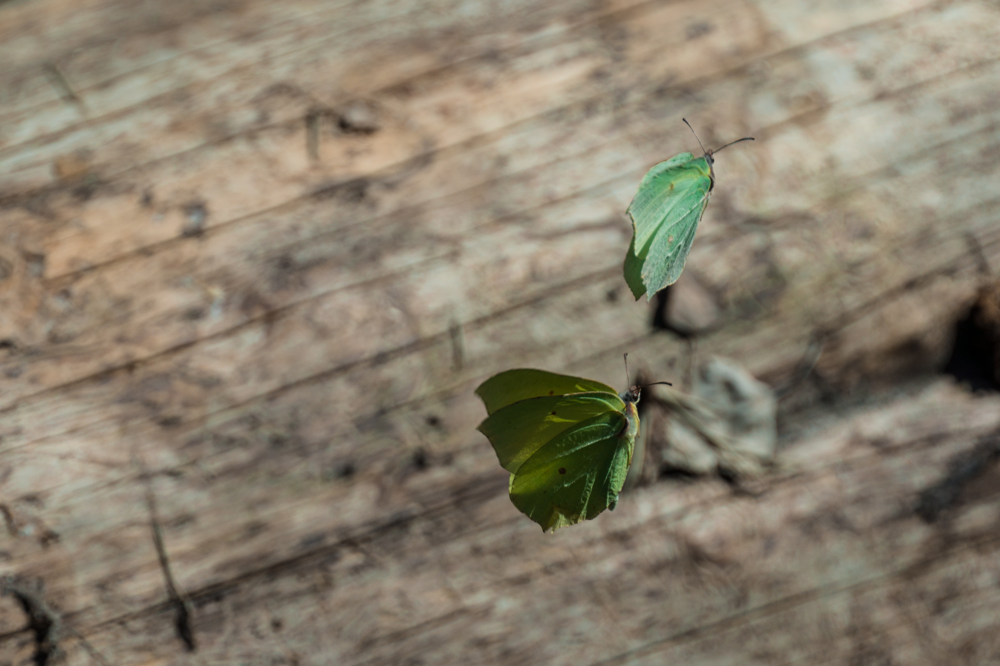
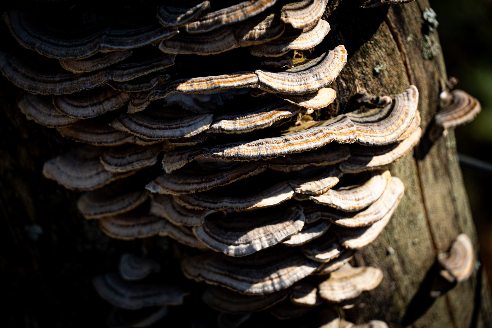
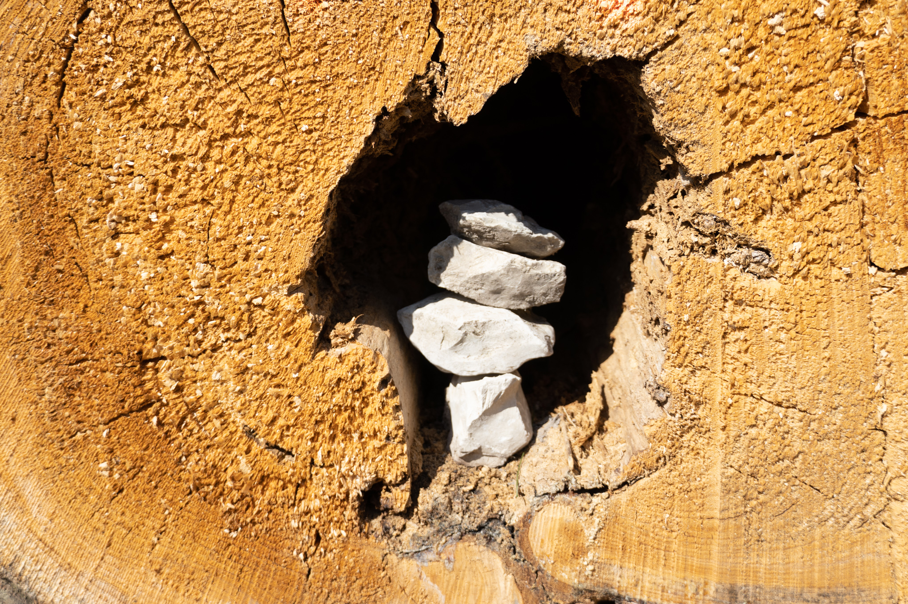
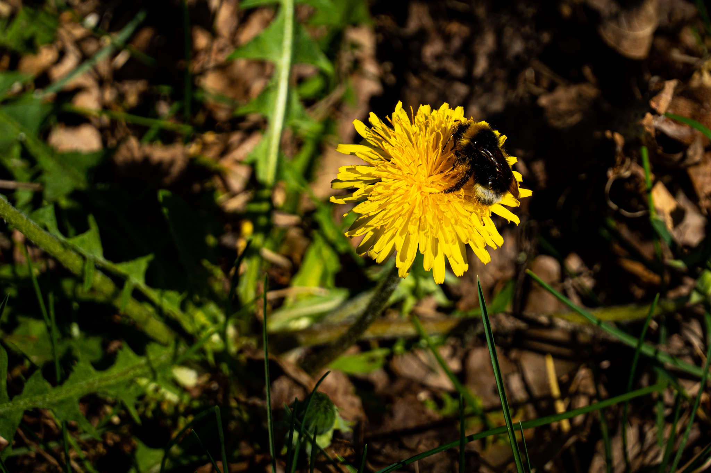
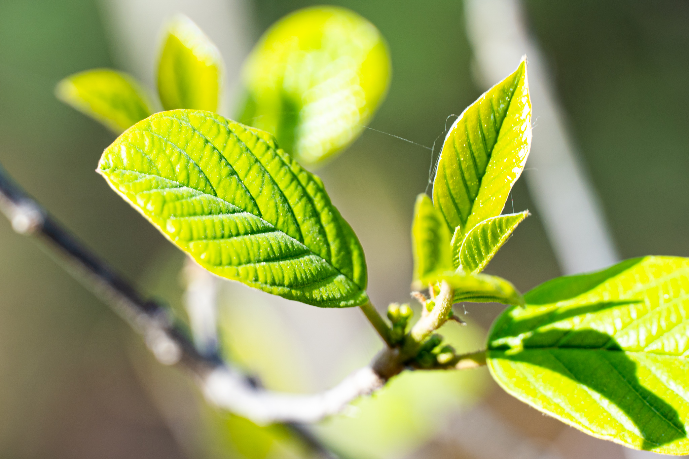

Das Naturschutzgroßprojekt (NGP) Senne und Teutoburger Wald umfasst als Alleinstellungsmerkmal Bereiche zweier deutscher Großlandschaften. Es ist das Zuhause für reichhalteige Flora und Fauna.

Die größte Tierart im NGP Senne sind die schottischen Hochlandrinder und Wildponys aus England. Diese lassen sich meist auf einer Wanderung von ca. 9 km durch die Weidegebiete des Projektes erblicken. ([NGP Senne](https://ngpsenne.de/naturerlebnisse/wanderwege-2/rundwanderweg-1/)) Dieses Mal hatten wir kein Glück auf dem Ochsenpfad. Dafür hier ein paar *kleinere Eindrücke*.

