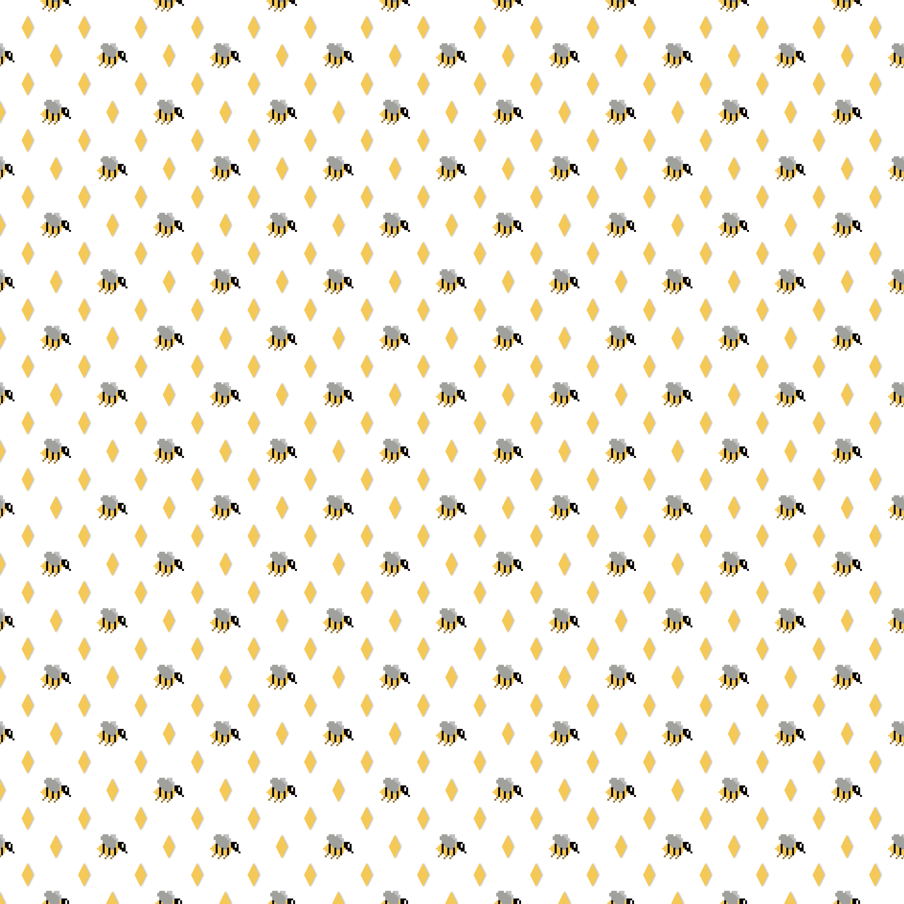
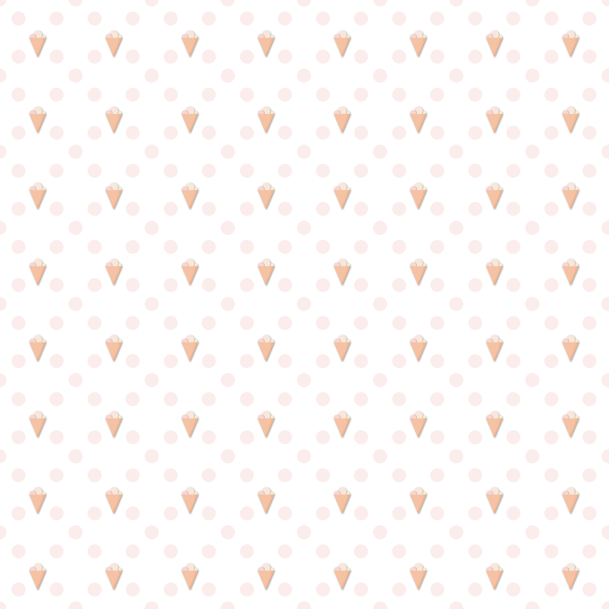
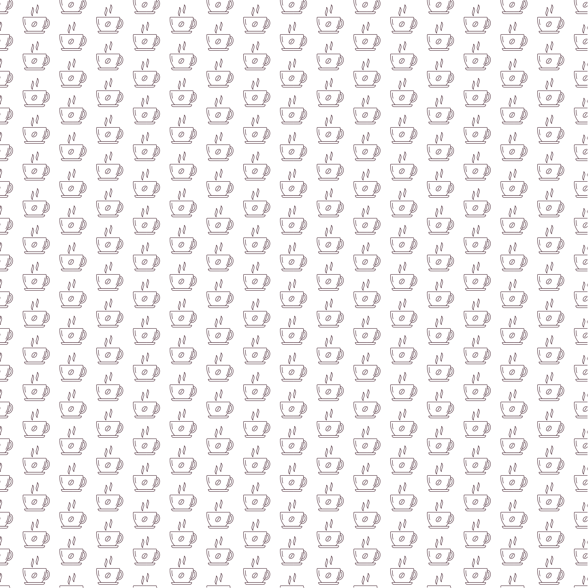
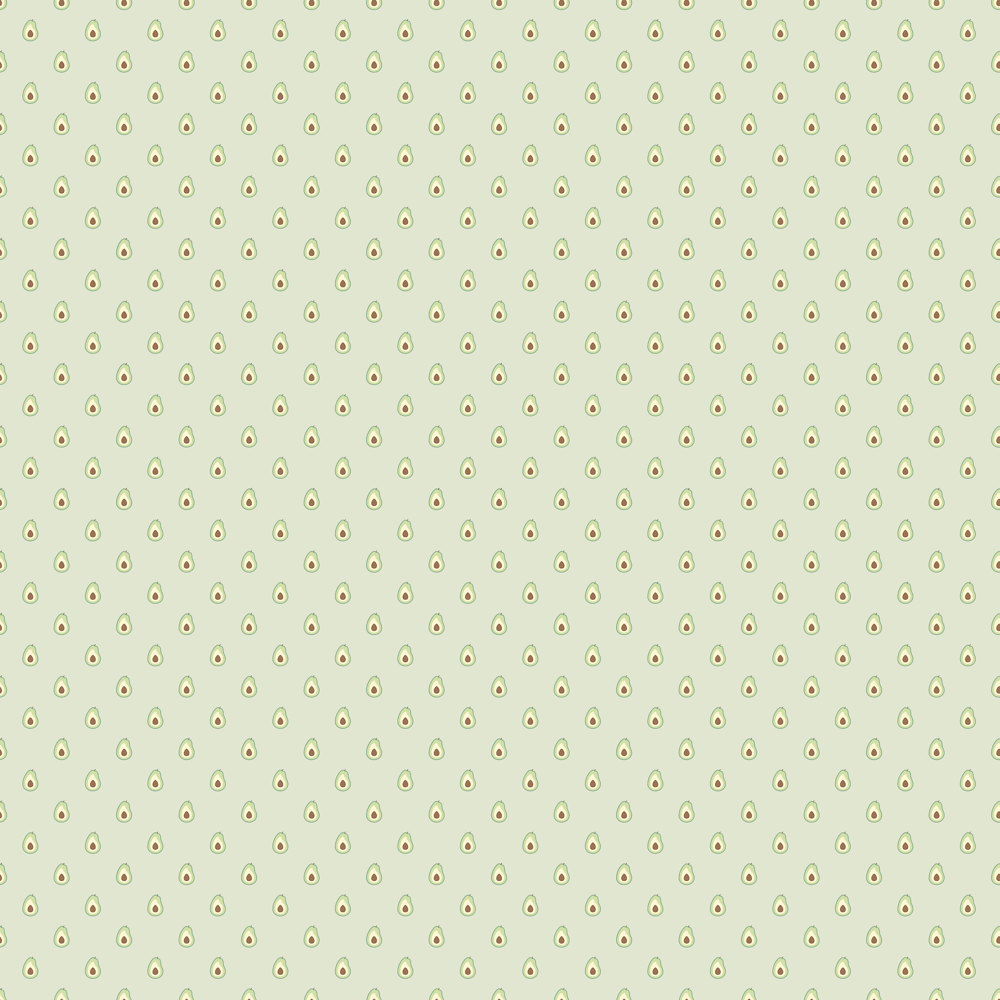

Hier habe ich ein bisschen mit Pattern experimentiert. Pattern sind einfach zu gestalten und durch wenige Kniffe zu schönem Muster-Papier auszubauen. Dieses kann als Geschenkpapier, transparent als (oder auf) Briefpapier, oder als Bild für Postkarten genutzt werden.

